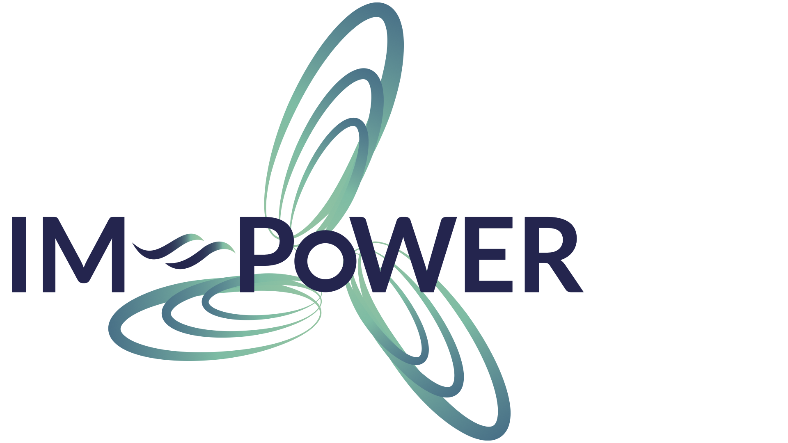

# Welcome to IM-Power 

**IM-POWER** aims to develop _A numerical Integrated Model for the POWER output of floating offshore wind farms that are fully grid-connected during sea storms_. This Horizon 2022 Marie Skłodowska-Curie Postdoctoral Fellowship project, funded by the Research Executive Agency (REA), focuses on renewable energy, wind energy, and floating offshore wind. The project also incorporates aspects of Computational Fluid Dynamics, power grid management, electricity distribution systems, and Smoothed Particle Hydrodynamics [(EC CORDIS)](https://ec.europa.eu/info/funding-tenders/opportunities/portal/screen/how-to-participate/org-details/999999999/project/101109440/program/43108390/details). The objective of IM-POWER is to ultimately:

  <h3 style="color: #2c3e50; margin-top: 0;">Project Objectives</h3>
  <ul style="list-style-type: none; padding-left: 0;">
    <li style="margin-bottom: 15px; display: flex; align-items: flex-start;">
      1
      

        <strong style="color: #2c3e50;">Impact FOWT Design:</strong>
        
Enhance design procedures for floating offshore wind turbines (FOWTs) to improve reliability in extreme weather conditions.

      

    </li>
    <li style="margin-bottom: 15px; display: flex; align-items: flex-start;">
      2
      

        <strong style="color: #2c3e50;">Power Grid Optimization:</strong>
        
Support power grid updates to accommodate the unique challenges posed by floating offshore wind farms, ensuring stable energy integration.

      

    </li>
  </ul>
  
  

  
  <h3 style="color: #2c3e50;">Project Methodology</h3>
  
  <figure style="margin: 0; text-align: center;">
    
    <figcaption style="margin-top: 10px; font-style: italic; color: #7f8c8d;">Figure 1: IM-POWER project methodology - Model strategy overview</figcaption>
  </figure>

