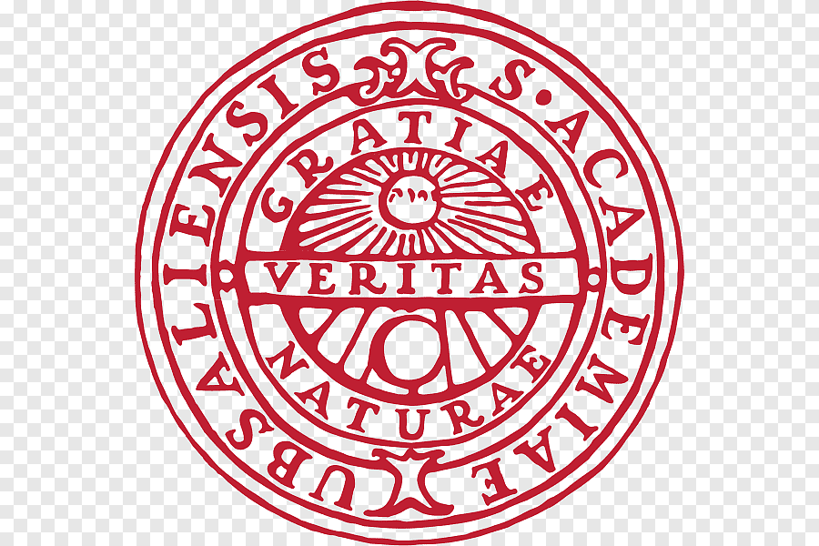

The project was built around two research objectives (**RO1** and **RO2**):

<strong>Objectives:</strong> 
<ul class="fancy-list">
  <li id="ro1"><strong>RO1</strong> Define and validate model-chain free software to address the spatial multi-scale nature of wave/wind generation and propagation for offshore wind farms under storm scenarios;</li>
  <li id="ro2"><strong>RO2</strong> Enhance the capabilities of existing open-source software towards a fully integrated tool for FOWTs suitable for high-fidelity simulations.</li>
</ul>

Significant **knowledge gaps** persist in several key areas of offshore wind systems during storm conditions:

1. **Turbine behavior**: The dynamic response of FOWTs under extreme wind and wave loads is not fully understood.
2. **Farm-level effects**: Interactions between multiple turbines in a farm during storms, including wake effects and power load redistributions, remain unclear.
3. **Grid integration**: The impact of rapid power fluctuations from storm-affected wind farms on grid stability and reliability is not well characterised.
4. **Forecasting challenges**: Accurate prediction of power output during extreme weather events is still difficult, complicating grid management.

These gaps have implications for power grid reliability, as highlighted by [Olauson et al. (2016)](#Olauson2016). A case study for Sweden by [Höltinger et al. (2019)](#Holtinger2019) further emphasises that extreme climate events can significantly challenge power systems when just 50% of intermittent renewable energy (IRE) is integrated.

## **Innovative aspects of the research programme**

**IM-POWER** uses a CFD platform that portrays an open-source software able to simulate FOWTs with high accuracy and robustness. The software can be used out of the box, without requiring modification of the source code. The project further provides:

- Critical information for the optimisation, design, and update of power grids and short-term storage facilities through the estimation of floating wind farm power output;

- An elevated understanding of FOWT structural performance to efficiently allocate wind farms.

The assessment of floating wind farm power output under storm conditions had not been attempted before this project, and no data is publicly available on FOWTs under sea storm conditions. Simulation inputs, geometries and reproducible templates generated by IM-POWER will be openly archived under CC BY 4.0 — see [Outcome](outcome.md).

## **Our research team**
The objectives of this Action are complex, and interdisciplinary challenges require combining state-of-the-art methods in modelling wind and wave loads; wind farm response (including dynamics, structural response, and power control); as well as grid balance and reliability. The work team is composed as follows:

* **Dr Bonaventura Tagliafierro**. Uppsala University – Uppsala, Sweden (Researcher)
* **Prof Malin Göteman**. Uppsala University – Uppsala, Sweden (Supervisor)
* **Dr Victor Mendoza**. Hexicon AB – Stockholm, Sweden (External Supervisor)

    
    

The Department of Electrical Engineering at Uppsala University (Sweden) is a leading research environment for future electric grid and renewable energy systems, with strong collaboration across industry, international research centres, and regulatory authorities. The partnership with Hexicon AB allowed the work to be grounded in the company's experience in offshore wind energy, platform design, and control systems, including a six-month secondment at the company.

## References

-  **Olauson et al. (2016)**: Olauson, J., Ayob, M.N., Bergkvist, M., Carpman, N., Castellucci, V., Goude, A., Lingfors, D., Waters, R., & Widén, J. (2016). Net load variability in Nordic countries with a highly or fully renewable power system. *Nature Energy*, 1(12). https://doi.org/10.1038/nenergy.2016.175

-  **Höltinger et al. (2019)**: Höltinger, S., Mikovits, C., Schmidt, J., Baumgartner, J., Arheimer, B., Lindström, G., & Wetterlund, E. (2019). The impact of climatic extreme events on the feasibility of fully renewable power systems: A case study for Sweden. *Energy*, 178, 695-713. https://doi.org/10.1016/j.energy.2019.04.128